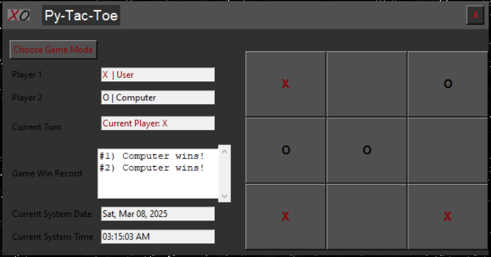

# Tic-Tac-Toe GUI App

This folder contains source code for a Python based GUI implmentation of the game Tic-Tac-Toe
				
## Python GUI:

## Python Project Structure

        │
        ├── main.py                        		# Main entry point for the Py-Tac-Toe application
        ├── gui_main.py                    		# Main GUI class that invokes the other classes defined in the other project files
        ├── gui_layout.py                  		# Handles configuring the GUI layout 
        ├── gui_controller.py              		# Handles top-level game logic that requires interaction with the GUI
        ├── game_logic.py                  		# Handles lower-level internal game logic and game state management
        └── Py-Tac-Toe_icon.png            		# Icon used in as the application logo